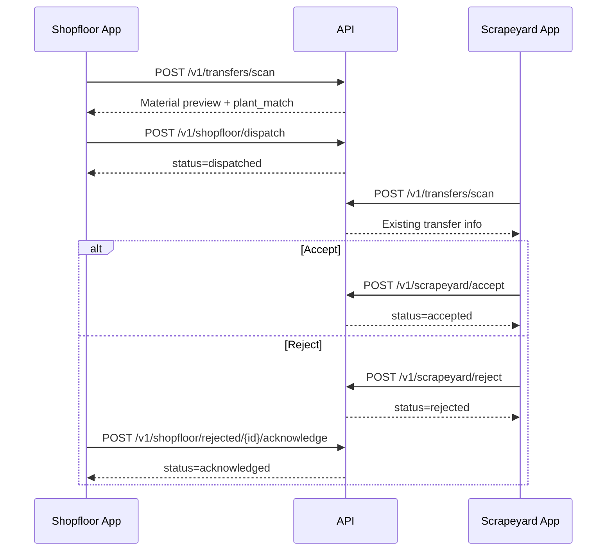

# DigiScrapyard API — Frontend Integration Guide

Base URL: `http://<host>:<port>` (default `http://localhost:8000`)

Interactive docs: `/docs` (Swagger) · `/redoc`

---

## Architecture overview

- **3 shopfloor plants** (UDE, UTE, U535) — each has its own login and employees
- **1 shared scrapeyard** — single login (`SCRAP`) serves all plants
- **Admin** — manages plants, scrapeyard config, reporting, and sales

QR codes are pre-generated by the weighing system. The backend parses `LOCATION` from the QR to determine which shopfloor plant the scrap belongs to.

### QR location → plant mapping

| Plant | QR `LOCATION` value |
|-------|---------------------|
| UTE | 2 |
| UDE | 3 |
| U535 | 4 |

**Dispatch rule:** the logged-in shopfloor plant must match the QR location plant. Example: UDE user scanning a UTE QR (`LOCATION: 2`) returns **403**.

---

## Authentication

### Login

`POST /v1/auth/login` (public)

**Shopfloor plant login:**
```json
{
  "login_id": "UDE",
  "password": "1234"
}
```

**Scrapeyard login:**
```json
{
  "login_id": "SCRAP",
  "password": "1234"
}
```

**Admin login:**
```json
{
  "login_id": "admin",
  "password": "Admin@123"
}
```

**Response (shopfloor):**
```json
{
  "access_token": "<jwt>",
  "token_type": "bearer",
  "role": "shopfloor",
  "plant_id": 1,
  "plant_name": "UDE",
  "employees": [{ "id": 1, "name": "Rohan" }]
}
```

**Response (scrapeyard):**
```json
{
  "access_token": "<jwt>",
  "token_type": "bearer",
  "role": "scrapeyard",
  "scrapeyard_id": 1,
  "scrapeyard_name": "Central Scrapeyard",
  "employees": [{ "id": 2, "name": "SY Employee" }]
}
```

**Response (admin):**
```json
{
  "access_token": "<jwt>",
  "token_type": "bearer",
  "role": "admin",
  "admin_name": "Admin"
}
```

### Authenticated requests

```
Authorization: Bearer <access_token>
```

For mutating shopfloor/scrapeyard actions, also send:
```
X-Employee-Id: <employee_profile_id>
```
(or pass `employee_id` in the JSON body where documented)

### Logout

`POST /v1/auth/logout` — client discards token locally.

---

## Role → Endpoint Matrix

| Endpoint | Shopfloor | Scrapeyard | Admin |
|----------|-----------|------------|-------|
| `POST /v1/auth/login` | ✓ | ✓ | ✓ |
| `GET /v1/employees` | ✓ | ✓ | |
| `POST /v1/transfers/scan` | ✓ | ✓ | |
| `GET /v1/transfers/history` | ✓ | ✓ | ✓ |
| `GET /v1/transfers/{id}` | ✓ | ✓ | ✓ |
| `POST /v1/shopfloor/dispatch` | ✓ | | |
| `GET /v1/shopfloor/rejected` | ✓ | | |
| `POST /v1/shopfloor/rejected/{id}/acknowledge` | ✓ | | |
| `POST /v1/scrapeyard/accept` | | ✓ | |
| `POST /v1/scrapeyard/reject` | | ✓ | |
| `GET/POST/PATCH/DELETE /v1/plants` | | | ✓ |
| `GET/PATCH /v1/scrapeyard-config` | | | ✓ |
| `GET /v1/reporting/*` | | | ✓ |
| `GET/POST /v1/sales` | | | ✓ |

---

## Transfer Flow



### 1. Scan QR

`POST /v1/transfers/scan`
```json
{ "qr_raw": "DATE: 23-06-2026\nCODE: 1313\nDESCRIPTION: CORRUGATED BOX SCRAP\nLOCATION: 3\nGROSS WT.: 7.350 Kg" }
```

**Response:**
```json
{
  "payload": {
    "qr_number": "a1b2c3...",
    "item_code": "1313",
    "item_name": "CORRUGATED BOX SCRAP",
    "location": 3,
    "uom": "KG",
    "quantity": "7.350",
    "gross_weight": "7.350"
  },
  "resolved_plant": {
    "id": 1,
    "code": "UDE",
    "name": "UDE",
    "login_id": "UDE",
    "qr_location": 3
  },
  "plant_match": true,
  "existing_transfer_id": null,
  "existing_status": null
}
```

`plant_match` is `true` when the logged-in shopfloor plant matches the QR location plant. For scrapeyard/admin scans, `plant_match` is omitted.

### 2. Dispatch (Shopfloor)

`POST /v1/shopfloor/dispatch`
```json
{
  "qr_raw": "<same scanned string>",
  "gp_number": "125",
  "employee_id": 1
}
```

Returns **403** if QR location plant does not match logged-in plant.

### 3. Accept (Scrapeyard)

`POST /v1/scrapeyard/accept`
```json
{
  "transfer_id": 1,
  "gr_number": "123",
  "employee_id": 2
}
```

### 4. Reject (Scrapeyard)

`POST /v1/scrapeyard/reject`

**Quantity mismatch:**
```json
{
  "transfer_id": 1,
  "reason_type": "quantity_mismatch",
  "qty_received": 90,
  "employee_id": 2
}
```

**Wrong material:**
```json
{
  "transfer_id": 1,
  "reason_type": "wrong_material",
  "material_received_name": "Plastic Bottles",
  "employee_id": 2
}
```

**Others:**
```json
{
  "transfer_id": 1,
  "reason_type": "others",
  "comment": "Wrong QR",
  "employee_id": 2
}
```

### 5. Acknowledge rejection (Shopfloor)

`POST /v1/shopfloor/rejected/{transfer_id}/acknowledge`

Headers: `X-Employee-Id: 1`

---

## History & Filters

`GET /v1/transfers/history?page=1&page_size=50&status=accepted&date_from=2026-01-01&date_to=2026-06-30&item_code=1313&material_name=SCRAP`

`GET /v1/shopfloor/rejected` — rejected items awaiting acknowledgement

`GET /v1/transfers/{id}` — detail with timeline events and rejection info

**Transfer detail response fields:** `qr_number`, `item_code`, `item_name`, `gp_number`, `gr_number`, `uom`, `quantity_sent`, `quantity_received`, `status`, `events[]`, `rejection`

---

## Admin — Plant Management

### List plants

`GET /v1/plants?search=UDE`

### Create plant

`POST /v1/plants`
```json
{
  "code": "UDE",
  "name": "Unit 3",
  "login_id": "UDE",
  "password": "securepass",
  "qr_location": 3,
  "address": "Doom Dooma, Assam",
  "employee_names": ["Riya", "Rishabh", "Raj"]
}
```

`qr_location` must be unique across plants.

### Update / Delete / Copy

- `PATCH /v1/plants/{id}`
- `DELETE /v1/plants/{id}` (soft deactivate)
- `POST /v1/plants/{id}/copy`

---

## Admin — Scrapeyard Configuration

There is a single shared scrapeyard for all plants.

### Get scrapeyard

`GET /v1/scrapeyard-config`

### Update scrapeyard

`PATCH /v1/scrapeyard-config`
```json
{
  "name": "Central Scrapeyard",
  "login_id": "SCRAP",
  "password": "newpass",
  "employee_names": ["Worker A", "Worker B"]
}
```

---

## Admin — Reporting

All reporting endpoints accept `plant_id`, `date_from`, `date_to` (YYYY-MM-DD).

| Endpoint | Purpose |
|----------|---------|
| `GET /v1/reporting/summary` | KPI cards |
| `GET /v1/reporting/plant-generation` | Bar chart by plant |
| `GET /v1/reporting/rejection-reasons` | Donut chart |
| `GET /v1/reporting/accepted-vs-sold` | Bar chart |
| `GET /v1/reporting/recent-transfers` | Recent table |

### Record sale

`POST /v1/sales`
```json
{
  "transfer_id": 1,
  "plant_id": 2,
  "quantity_kg": 7.35,
  "quantity_ea": 0,
  "amount_inr": 84000.00,
  "notes": "Sold after shredding"
}
```

---

## Error Codes

| Code | Meaning |
|------|---------|
| 401 | Missing/invalid token |
| 403 | Wrong role, or shopfloor plant does not match QR location |
| 404 | Resource not found |
| 409 | Duplicate QR / login ID |
| 422 | Validation error (missing rejection fields, bad QR) |

---

## Pagination

List endpoints use `page` (1-based) and `page_size` (max 200).

Response shape: `{ "total": N, "items": [...] }`

---

## Status Values

`pending` → `dispatched` → `accepted` | `rejected` → `acknowledged` | `sold`

---

## Seeded credentials (after `scripts/seed_data.py`)

| Role | login_id | password | QR location |
|------|----------|----------|-------------|
| Admin | admin | Admin@123 | — |
| UDE | UDE | 1234 | 3 |
| UTE | UTE | 1234 | 2 |
| U535 | U535 | 1234 | 4 |
| Scrapeyard | SCRAP | 1234 | — |
