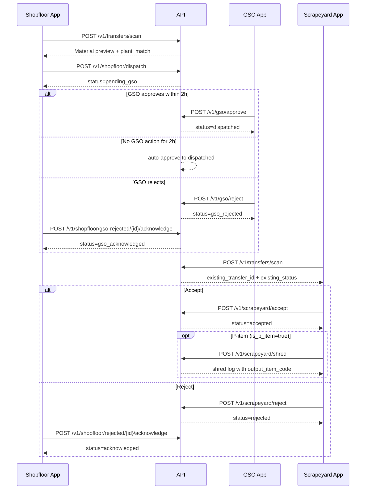

# DigiScrapyard API — Frontend Integration Guide

Base URL: `http://<host>:<port>` (e.g. `http://localhost:8006` for local dev, or your deployed server URL)

Interactive docs: `/docs` (Swagger) · `/redoc` — use alongside this guide for exact schemas.

Health check: `GET /` (public) → `{ "status": "DigiScrapyard API is running" }`

---

## Recent updates (June 2026) — frontend checklist

| Area | What changed |
|------|----------------|
| **P-items** | 7 shreddable PLU codes (`P159`, `P106`, `PB06`, `PC06`, `P153`, `P100`, `P177`) use a **pre-shred identity** — show PLU + display name until shredded |
| **Scan / transfer fields** | New `is_p_item` on scan payload and all transfer responses; `item_code_8` is **`null` for P-items** |
| **Shred workflow** | New scrapeyard endpoints: `POST /v1/scrapeyard/shred`, `GET /v1/scrapeyard/shred-log`, `GET /v1/scrapeyard/shred-log/{id}` |
| **Display rules** | Normal items: `item_code` = 8-digit SAP code. P-items: `item_code` = PLU (e.g. `P159`), `item_name` = display name (e.g. `Cartons`) |
| **8-digit after shred** | Only appears in **shred log** (`output_item_code`, `output_name`) — not on the transfer itself |
| **Material state** | Required on QR dispatch when `is_shreddable: true` (all P-items). `1499 GARBAGE` is **not** shreddable |
| **Admin items** | Item master responses include `is_p_item`, `shred_output_item_code`, `shred_output_name` |

**Scrapeyard P-item UI flow:** scan → accept → **shred save** (new screen) → shred log lists 8-digit output.

---

## Architecture overview

- **3 shopfloor plants** (UDE, UTE, U535) — each has its own login and employees
- **1 shared GSO** — single login (`GSO`) approves dispatches before scrapeyard intake
- **1 shared scrapeyard** — single login (`SCRAP`) serves all plants
- **Admin** — manages plants, scrapeyard config, reporting, and sales

QR codes are pre-generated by the weighing system. The backend parses `LOCATION` from the QR to determine which shopfloor plant the scrap belongs to.

### QR location → plant mapping

| Plant | QR `LOCATION` value |
|-------|---------------------|
| UTE | 2 |
| UDE | 3 |
| U535 | 4 |

**Dispatch rule:** the logged-in shopfloor plant must match the QR location plant. Example: UDE user dispatching a UTE QR (`LOCATION: 2`) returns **403**.

### QR payload format (from weighing system)

The scanner should send the **full raw string** as `qr_raw`. Typical format:

```
HIDUSTAN UNILEVER LIMITED
DATE: 25-06-2026
TIME: 10:00:01
CODE: 1313
DESCRIPTION: CORRUGATED BOX SCRAP
LOCATION: 3
NET WT.: 7.350 Kg
TARE WT.: 0.000 Kg
GROSS WT.: 7.350 Kg
```

| Field | Required for | Notes |
|-------|--------------|-------|
| `CODE` | Scan + dispatch | 4-digit PLU code — looked up in `item_master` for name and 8-digit code |
| `DESCRIPTION` | — | Optional; item name comes from DB lookup |
| `LOCATION` | QR dispatch | Maps to shopfloor plant |
| Weight lines | Scan | `GROSS WT.` or `NET WT.` used for quantity (KG) |

**Dispatch rules by UOM:**
- **KG items** → QR dispatch only (`POST /v1/shopfloor/dispatch`)
- **EA items** → manual dispatch only (`POST /v1/shopfloor/dispatch/manual`)

**Shreddable items (P-items):** 7 KG PLU codes (`P159`, `P106`, `PB06`, `PC06`, `P100`, `P177`, `P153`) require `material_state` (`shredded` or `not_shredded`) on QR dispatch. All other items default to `not_shredded`.

**P-items vs normal items:**
- **Normal KG items** — transfer shows 8-digit SAP `item_code` and mapped name from `item_master`
- **P-items** — transfer shows PLU code (e.g. `P159`) and P-list display name (e.g. `Cartons`); 8-digit code is **not** exposed on scan/dispatch/accept/reject
- After shredding at scrapeyard, `POST /v1/scrapeyard/shred` records the 8-digit output in `shred_log`

### P-item reference (shreddable PLUs)

| PLU | Display name (show in UI) | After shred — 8-digit | After shred — name |
|-----|---------------------------|----------------------|-------------------|
| P159 | Cartons | 1000091259 | CARTONS -JT |
| P106 | Bottles & Caps | 1000090406 | LIQUID MIX BOTTLE & CAPS SCRAP |
| PB06 | Bottles | 1000090406 | LIQUID MIX BOTTLE & CAPS SCRAP |
| PC06 | Caps | 1000090406 | LIQUID MIX BOTTLE & CAPS SCRAP |
| P153 | Tubes | 1000091253 | TUBE CUTTING-JT |
| P100 | Squeezed Tubes | 1000090402 | Empty Tube Scrap |
| P177 | Laminates | 1000090077 | SHREDED LAMINATES |

> **Note:** `1259` (CARTONS -JT) is a **normal** KG item with 8-digit `1000091259` — not a P-item. `P159` is the pre-shred carton P-code.

### Frontend display rules

| Context | Normal item | P-item (`is_p_item: true`) |
|---------|-------------|----------------------------|
| Scan `payload.item_name` | Mapped name from DB | P-list display name |
| Scan `payload.item_code_8` | 8-digit SAP code | **`null`** — do not show |
| Scan `payload.plu_code` | PLU from QR | PLU from QR |
| Transfer `item_code` | 8-digit SAP code | PLU code (e.g. `P159`) |
| Transfer `item_name` | Mapped name | P-list display name |
| After shred | N/A | Read `output_item_code` / `output_name` from shred log |

**Client-confirmed PLU → 8-digit overrides** (applied during import): `1402` → `1000090402`, `1081`, `1430`, `1763`, `1313`, `1259`, `1750`, `1253`, `1314`, `1021` — see `app/constants/items.py`. Multiple PLUs may share the same 8-digit SAP code (e.g. `1750` and `1766` → `1000090766`).

**Import files:** `upated_itemcode.xlsx` (PLU list) and `updated_8digit.xlsx` (vendor rates). Run `python scripts/import_client_data.py` after deploy.

---

## Data conventions

| Type | Format |
|------|--------|
| Decimals | JSON **strings** (e.g. `"7.350"`, `"84000.00"`) — parse in TypeScript as needed |
| Timestamps | Unix **seconds** (`dispatched_at`, `processed_at`, `acknowledged_at`, `sold_at`, `sent_on`) |
| JWT expiry | Default **24 hours** (`JWT_EXPIRE_HOURS`); on **401**, redirect to login |
| CORS | Enabled for all origins |

---

## Authentication

### Login

`POST /v1/auth/login` (public)

**Shopfloor plant login:**
```json
{
  "login_id": "UDE",
  "password": "1234"
}
```

**Scrapeyard login:**
```json
{
  "login_id": "SCRAP",
  "password": "1234"
}
```

**Admin login:**
```json
{
  "login_id": "admin",
  "password": "Admin@123"
}
```

**Response (shopfloor):**
```json
{
  "access_token": "<jwt>",
  "token_type": "bearer",
  "role": "shopfloor",
  "plant_id": 1,
  "plant_name": "UDE",
  "employees": [{ "id": 1, "name": "Employee 1" }]
}
```

**Response (scrapeyard):**
```json
{
  "access_token": "<jwt>",
  "token_type": "bearer",
  "role": "scrapeyard",
  "scrapeyard_id": 1,
  "scrapeyard_name": "Central Scrapeyard",
  "employees": [{ "id": 13, "name": "Employee 1" }]
}
```

**Response (GSO):**
```json
{
  "access_token": "<jwt>",
  "token_type": "bearer",
  "role": "gso",
  "gso_id": 1,
  "gso_name": "General Shift Officer",
  "employees": [{ "id": 17, "name": "Employee 1" }]
}
```

**Response (admin):**
```json
{
  "access_token": "<jwt>",
  "token_type": "bearer",
  "role": "admin",
  "admin_name": "Admin"
}
```

Store `access_token`, `role`, and role-specific IDs (`plant_id` / `scrapeyard_id` / `gso_id`). Shopfloor, scrapeyard, and GSO logins include `employees[]` for picker UI; you can also refresh via `GET /v1/employees`.

### Authenticated requests

```
Authorization: Bearer <access_token>
```

### Employee ID — per endpoint

| Endpoint | How to pass employee |
|----------|---------------------|
| `POST /v1/shopfloor/dispatch` | `employee_id` in JSON body |
| `POST /v1/gso/approve` | `employee_id` in JSON body |
| `POST /v1/gso/reject` | `employee_id` in JSON body |
| `POST /v1/scrapeyard/accept` | `employee_id` in JSON body |
| `POST /v1/scrapeyard/reject` | `employee_id` in JSON body |
| `POST /v1/scrapeyard/shred` | `employee_id` in JSON body |
| `POST /v1/shopfloor/rejected/{id}/acknowledge` | **`X-Employee-Id` header only** (no body) |
| `POST /v1/shopfloor/gso-rejected/{id}/acknowledge` | **`X-Employee-Id` header only** (no body) |

### Logout

`POST /v1/auth/logout` — requires `Authorization: Bearer`. Client discards token locally.

---

## Role → Endpoint Matrix

| Endpoint | Shopfloor | GSO | Scrapeyard | Admin |
|----------|-----------|-----|------------|-------|
| `GET /` | ✓ | ✓ | ✓ | ✓ |
| `POST /v1/auth/login` | ✓ | ✓ | ✓ | ✓ |
| `POST /v1/auth/logout` | ✓ | ✓ | ✓ | ✓ |
| `GET /v1/employees` | ✓ | ✓ | ✓ | |
| `POST /v1/transfers/scan` | ✓ | | ✓ | |
| `GET /v1/transfers/history` | ✓ | ✓ | ✓ | ✓ |
| `GET /v1/transfers/{id}` | ✓ | ✓ | ✓ | ✓ |
| `POST /v1/shopfloor/dispatch` | ✓ | | | |
| `GET /v1/shopfloor/items` | ✓ | | | |
| `POST /v1/shopfloor/dispatch/manual` | ✓ | | | |
| `GET /v1/shopfloor/rejected` | ✓ | | | |
| `POST /v1/shopfloor/rejected/{id}/acknowledge` | ✓ | | | |
| `GET /v1/shopfloor/gso-rejected` | ✓ | | | |
| `POST /v1/shopfloor/gso-rejected/{id}/acknowledge` | ✓ | | | |
| `GET /v1/gso/pending` | | ✓ | | |
| `GET /v1/gso/history` | | ✓ | | |
| `GET /v1/gso/{id}` | | ✓ | | |
| `POST /v1/gso/approve` | | ✓ | | |
| `POST /v1/gso/reject` | | ✓ | | |
| `POST /v1/scrapeyard/accept` | | | ✓ | |
| `POST /v1/scrapeyard/reject` | | | ✓ | |
| `POST /v1/scrapeyard/shred` | | | ✓ | |
| `GET /v1/scrapeyard/shred-log` | | | ✓ | |
| `GET /v1/scrapeyard/shred-log/{id}` | | | ✓ | |
| `GET /v1/plants` | | | ✓ |
| `GET /v1/plants/{id}` | | | ✓ |
| `POST /v1/plants` | | | ✓ |
| `PATCH /v1/plants/{id}` | | | ✓ |
| `DELETE /v1/plants/{id}` | | | ✓ |
| `POST /v1/plants/{id}/copy` | | | ✓ |
| `GET /v1/scrapeyard-config` | | | ✓ |
| `PATCH /v1/scrapeyard-config` | | | ✓ |
| `GET /v1/reporting/*` | | | ✓ |
| `GET /v1/items` | | | ✓ |
| `POST /v1/items` | | | ✓ |
| `GET /v1/vendors` | | | ✓ |
| `GET /v1/sales` | | | ✓ |
| `POST /v1/sales` | | | ✓ |

> **Note:** Admin cannot call `POST /v1/transfers/scan` (returns **403**).

---

## Employees

`GET /v1/employees` — shopfloor or scrapeyard only.

Returns active employees for the logged-in plant or scrapeyard.

**Response:**
```json
{
  "total": 4,
  "items": [
    { "id": 1, "name": "Employee 1" },
    { "id": 2, "name": "Employee 2" }
  ]
}
```

---

## Transfer Flow



**GSO UX:** `GET /v1/gso/pending` lists items awaiting approval. Approve via `POST /v1/gso/approve` or reject with a required `reason` via `POST /v1/gso/reject`. `GET /v1/gso/history` supports `status` filter: `approved`, `rejected`, or `auto_approved`.

**Scrapeyard UX:** after scan, use `existing_transfer_id` and `existing_status`. If status is `pending_gso`, show awaiting GSO approval. When `dispatched`, drive accept/reject. Pass that `transfer_id` to accept/reject endpoints. For **P-items** (`is_p_item: true` on scan payload), after accept show a **Shred Save** action that calls `POST /v1/scrapeyard/shred`.

### 1. Scan QR

`POST /v1/transfers/scan` — shopfloor or scrapeyard only.

```json
{ "qr_raw": "<full scanned string>" }
```

**Response:**
```json
{
  "payload": {
    "qr_number": "8e6174a45b3bf73b",
    "item_code": "1313",
    "plu_code": "1313",
    "item_code_8": "1000090313",
    "item_name": "CORRUGATED BOX SCRAP",
    "is_p_item": false,
    "is_shreddable": false,
    "requires_material_state": false,
    "location": 3,
    "net_weight": "7.350",
    "tare_weight": "0.000",
    "gross_weight": "7.350",
    "uom": "KG",
    "quantity": "7.350",
    "date_str": "25-06-2026",
    "time_str": "10:00:01"
  },
  "resolved_plant": {
    "id": 1,
    "code": "UDE",
    "name": "UDE",
    "login_id": "UDE",
    "qr_location": 3
  },
  "plant_match": true,
  "existing_transfer_id": null,
  "existing_status": null
}
```

- **`plant_match`:** `true` / `false` for **shopfloor** only (logged-in plant vs QR location).
- **Scrapeyard:** `plant_match` is `null`; use `existing_transfer_id` when a transfer already exists.
- Returns **422** if PLU code is unknown or item UOM is `EA` (use manual dispatch).
- **`is_p_item`:** when `true`, `item_code_8` is `null` — use `item_name` + `plu_code` for display.
- **`requires_material_state`:** when `true`, dispatch must include `material_state` (`shredded` | `not_shredded`).

**P-item scan example** (`CODE: P159`):
```json
{
  "payload": {
    "qr_number": "a1b2c3d4e5f6g7h8",
    "item_code": "P159",
    "plu_code": "P159",
    "item_code_8": null,
    "item_name": "Cartons",
    "is_p_item": true,
    "is_shreddable": true,
    "requires_material_state": true,
    "uom": "KG",
    "quantity": "12.000",
    "location": 3
  },
  "resolved_plant": { "id": 1, "login_id": "UDE", "qr_location": 3 },
  "plant_match": true,
  "existing_transfer_id": null,
  "existing_status": null
}
```

### 2. Dispatch — QR (Shopfloor, KG items)

`POST /v1/shopfloor/dispatch`
```json
{
  "qr_raw": "<same scanned string>",
  "employee_id": 1,
  "material_state": "not_shredded"
}
```

`material_state` is **required** when the item is shreddable; omit or pass `not_shredded` for other KG items.

Returns **403** if QR location plant does not match logged-in plant. Returns **422** for EA items.

**Response:** full `TransferResponse` (see below) with `status: "dispatched"`.

### 2b. Dispatch — Manual (Shopfloor, EA items)

`GET /v1/shopfloor/items` — list active EA items for manual dispatch dropdowns.

**Response:**
```json
{
  "items": [
    {
      "id": 12,
      "plu_code": "1021",
      "item_code": "1000090021",
      "name": "EMPTY IRON DRUM 200LTR",
      "uom": "EA",
      "is_shreddable": false
    }
  ]
}
```

`POST /v1/shopfloor/dispatch/manual`
```json
{
  "item_master_id": 12,
  "quantity": "10",
  "material_state": "not_shredded",
  "employee_id": 1
}
```

### 3. Accept (Scrapeyard)

`POST /v1/scrapeyard/accept`
```json
{
  "transfer_id": 1,
  "employee_id": 13
}
```

### 4. Reject (Scrapeyard)

`POST /v1/scrapeyard/reject`

| `reason_type` | Required extra fields |
|---------------|----------------------|
| `quantity_mismatch` | `qty_received` |
| `wrong_material` | `material_received_name` |
| `others` | `comment` |

**Quantity mismatch:**
```json
{
  "transfer_id": 2,
  "reason_type": "quantity_mismatch",
  "qty_received": 2.5,
  "employee_id": 13
}
```

**Wrong material:**
```json
{
  "transfer_id": 1,
  "reason_type": "wrong_material",
  "material_received_name": "Plastic Bottles",
  "employee_id": 13
}
```

**Others:**
```json
{
  "transfer_id": 1,
  "reason_type": "others",
  "comment": "Wrong QR",
  "employee_id": 13
}
```

### 4b. Shred log (Scrapeyard, P-items only)

After accepting a P-item transfer, record shred completion:

`POST /v1/scrapeyard/shred`
```json
{
  "transfer_id": 1,
  "quantity_kg": "12.000",
  "employee_id": 13
}
```

Validation: transfer must be `accepted`, `is_p_item=true`, and no existing shred log for that transfer. Output 8-digit code/name come from `item_master.shred_output_*`.

**Response (201):**
```json
{
  "id": 1,
  "transfer_id": 1,
  "scrapeyard_id": 1,
  "input_plu_code": "P159",
  "input_name": "Cartons",
  "output_item_code": "1000091259",
  "output_name": "CARTONS -JT",
  "quantity_kg": "12.000",
  "shredded_at": 1782396300
}
```

`GET /v1/scrapeyard/shred-log` — list for logged-in scrapeyard.

Query params: `output_item_code`, `date_from`, `date_to` (unix seconds), `page`, `page_size`.

**List response:**
```json
{
  "total": 1,
  "items": [
    {
      "id": 1,
      "transfer_id": 42,
      "scrapeyard_id": 1,
      "input_plu_code": "P159",
      "input_name": "Cartons",
      "output_item_code": "1000091259",
      "output_name": "CARTONS -JT",
      "quantity_kg": "12.000",
      "shredded_at": 1782396300
    }
  ]
}
```

`GET /v1/scrapeyard/shred-log/{id}` — single entry detail (same object shape as list item).

**Shred errors:**

| Code | When |
|------|------|
| 400 | Transfer not `accepted`; transfer is not a P-item (`is_p_item: false`) |
| 404 | Transfer or shred log entry not found |
| 409 | Shred log already exists for this transfer |
| 422 | P-item has no shred output mapping configured |

### 5. Acknowledge rejection (Shopfloor)

`POST /v1/shopfloor/rejected/{transfer_id}/acknowledge`

```
X-Employee-Id: 5
```

No request body. Returns **400** if transfer is not in `rejected` status.

---

## Transfer responses

### Detail (`GET /v1/transfers/{id}`)

```json
{
  "id": 1,
  "qr_number": "8e6174a45b3bf73b",
  "plu_code": "1313",
  "item_code": "1000090313",
  "item_name": "CORRUGATED BOX SCRAP",
  "description": "CORRUGATED BOX SCRAP",
  "uom": "KG",
  "quantity_sent": "7.350",
  "quantity_received": "7.350",
  "dispatch_method": "qr",
  "material_state": "not_shredded",
  "is_p_item": false,
  "is_shreddable": false,
  "location": 3,
  "net_weight": "7.350",
  "tare_weight": "0.000",
  "gross_weight": "7.350",
  "status": "accepted",
  "dispatched_at": 1782396208,
  "processed_at": 1782396216,
  "acknowledged_at": null,
  "events": [
    {
      "id": 1,
      "event_type": "dispatched",
      "actor_role": "shopfloor",
      "employee_name": "Employee 1",
      "quantity": "7.350",
      "comment": null,
      "created_at": 1782396208
    },
    {
      "id": 2,
      "event_type": "accepted",
      "actor_role": "scrapeyard",
      "employee_name": "Employee 1",
      "quantity": "7.350",
      "comment": null,
      "created_at": 1782396216
    }
  ],
  "rejection": null
}
```

When rejected, `rejection` contains `reason_type`, `qty_received`, `material_received_name`, `comment`.

**P-item transfer example** (accepted P159 — note `item_code` is PLU, not 8-digit):
```json
{
  "id": 42,
  "qr_number": "a1b2c3d4e5f6g7h8",
  "plu_code": "P159",
  "item_code": "P159",
  "item_name": "Cartons",
  "uom": "KG",
  "quantity_sent": "12.000",
  "quantity_received": "12.000",
  "dispatch_method": "qr",
  "material_state": "not_shredded",
  "is_p_item": true,
  "is_shreddable": true,
  "status": "accepted",
  "dispatched_at": 1782396208,
  "processed_at": 1782396216,
  "events": [],
  "rejection": null
}
```

The 8-digit identity (`1000091259` / `CARTONS -JT`) appears only after calling `POST /v1/scrapeyard/shred` — fetch from shred log, not from this transfer object.

### History list item (slimmer)

```json
{
  "id": 1,
  "qr_number": "8e6174a45b3bf73b",
  "plu_code": "1313",
  "item_code": "1000090313",
  "item_name": "CORRUGATED BOX SCRAP",
  "uom": "KG",
  "quantity_sent": "7.350",
  "quantity_received": "7.350",
  "dispatch_method": "qr",
  "material_state": "not_shredded",
  "is_p_item": false,
  "is_shreddable": false,
  "status": "accepted",
  "dispatched_at": 1782396208,
  "processed_at": 1782396216
}
```

---

## History & Filters

`GET /v1/transfers/history`

Query params: `page`, `page_size` (max 200), `status`, `material_state` (`shredded` | `not_shredded`), `date_from`, `date_to` (YYYY-MM-DD), `item_code`, `material_name`, `plant_id` (admin only).

**Role-scoped behavior:**

| Role | Scope |
|------|-------|
| Shopfloor | Auto-filtered to **logged-in plant** (`plant_id` param ignored) |
| Scrapeyard | Auto-filtered to **logged-in scrapeyard** |
| Admin | All plants; optional `plant_id` filter |

Example:
```
GET /v1/transfers/history?page=1&page_size=50&status=accepted&date_from=2026-01-01&date_to=2026-06-30&item_code=1313&material_name=SCRAP
```

`GET /v1/shopfloor/rejected` — rejected transfers for logged-in plant awaiting acknowledgement (supports `page`, `page_size`, `item_code`, `material_name`).

`GET /v1/transfers/{id}` — full detail with timeline.

---

## Admin — Item Master

`GET /v1/items` — list/search (`search`, `uom`, `is_shreddable`, `page`, `page_size`)

`POST /v1/items` — create item
```json
{
  "plu_code": "1313",
  "item_code": "1000090313",
  "name": "CORRUGATED BOX SCRAP",
  "uom": "KG",
  "is_shreddable": false,
  "is_p_item": false
}
```

**P-item create example** (no `item_code` until shredded; shred output configured on master):
```json
{
  "plu_code": "P159",
  "name": "Cartons",
  "uom": "KG",
  "is_shreddable": true,
  "is_p_item": true,
  "shred_output_item_code": "1000091259",
  "shred_output_name": "CARTONS -JT"
}
```

**Item response fields** (list + detail): `id`, `plu_code`, `item_code` (null for P-items), `name`, `uom`, `is_shreddable`, `is_p_item`, `shred_output_item_code`, `shred_output_name`, `is_active`, `created_at`, `updated_at`.

> Multiple PLUs may share the same `item_code` (8-digit SAP code) — e.g. `1750` and `1766` both use `1000090766`.

`GET /v1/items/{id}` · `PATCH /v1/items/{id}` · `DELETE /v1/items/{id}` (soft delete)

Seed client data: `python scripts/import_client_data.py --item-code <path> --client-data <path>`

---

## Admin — Vendors

`GET /v1/vendors` · `POST /v1/vendors` · `GET/PATCH/DELETE /v1/vendors/{id}`

Vendor item assignments:
- `GET /v1/vendors/{id}/items`
- `POST /v1/vendors/{id}/items` — `{ "item_id": 1, "rate_inr": "7.00" }`
- `PATCH /v1/vendors/{id}/items/{vendor_item_id}` · `DELETE /v1/vendors/{id}/items/{vendor_item_id}`

---

## Admin — Plant Management

### List plants

`GET /v1/plants?search=UDE`

**Response:** `{ "total": N, "items": [ PlantResponse, ... ] }`

### Get plant

`GET /v1/plants/{id}`

### Create plant

`POST /v1/plants`
```json
{
  "code": "UDE",
  "name": "Unit 3",
  "login_id": "UDE",
  "password": "securepass",
  "qr_location": 3,
  "address": "Doom Dooma, Assam",
  "employee_names": ["Riya", "Rishabh", "Raj"]
}
```

`qr_location` must be unique across plants.

### Update plant

`PATCH /v1/plants/{id}` — all fields optional:
```json
{
  "code": "UDE",
  "name": "Updated Name",
  "login_id": "UDE",
  "password": "newpass",
  "qr_location": 3,
  "address": "Assam",
  "employee_names": ["Employee A", "Employee B"]
}
```

Passing `employee_names` **replaces** the active employee list for that plant.

### Delete plant

`DELETE /v1/plants/{id}` — soft deactivate (`is_active: false`).

### Copy plant

`POST /v1/plants/{id}/copy` — no body.

Auto-generates:
- `login_id`: `{source}-copy-{timestamp}`
- `qr_location`: source `qr_location + 1000`
- `password`: `ChangeMe123!`

---

## Admin — Scrapeyard Configuration

Single shared scrapeyard for all plants.

### Get scrapeyard

`GET /v1/scrapeyard-config`

**Response:**
```json
{
  "id": 1,
  "name": "Central Scrapeyard",
  "login_id": "SCRAP",
  "is_active": true,
  "employees": [
    { "id": 13, "name": "Employee 1" },
    { "id": 14, "name": "Employee 2" }
  ]
}
```

### Update scrapeyard

`PATCH /v1/scrapeyard-config` — all fields optional:
```json
{
  "name": "Central Scrapeyard",
  "login_id": "SCRAP",
  "password": "newpass",
  "employee_names": ["Worker A", "Worker B"]
}
```

---

## Admin — Reporting

| Endpoint | Query params |
|----------|--------------|
| `GET /v1/reporting/summary` | `plant_id`, `date_from`, `date_to` |
| `GET /v1/reporting/plant-generation` | `date_from`, `date_to` |
| `GET /v1/reporting/rejection-reasons` | `plant_id`, `date_from`, `date_to` |
| `GET /v1/reporting/accepted-vs-sold` | `plant_id`, `date_from`, `date_to` |
| `GET /v1/reporting/recent-transfers` | `plant_id`, `limit` (1–100, default 10) |

Dates: `YYYY-MM-DD`.

### Summary (`GET /v1/reporting/summary`)

```json
{
  "total_generated": { "kg": "10.550", "ea": "0" },
  "total_accepted": { "kg": "7.350", "ea": "0" },
  "total_rejected": { "kg": "2.500", "ea": "0" },
  "accepted_percentage": 69.7,
  "rejected_percentage": 23.7,
  "total_sold": { "kg": "7.350", "ea": "0" },
  "current_inventory": { "kg": "0", "ea": "0" },
  "revenue_inr": "84000.00",
  "avg_time_to_accept_days": 0.0,
  "transfer_count": 2
}
```

### Plant generation

```json
[
  {
    "plant_id": 1,
    "plant_name": "UDE",
    "generated": { "kg": "7.350", "ea": "0" },
    "accepted": { "kg": "7.350", "ea": "0" },
    "rejected": { "kg": "0", "ea": "0" }
  }
]
```

### Rejection reasons

```json
[
  {
    "reason_type": "quantity_mismatch",
    "kg": "2.500",
    "ea": "0",
    "percentage": 100.0
  }
]
```

### Accepted vs sold

```json
[
  { "label": "Accepted", "kg": "7.350", "ea": "0" },
  { "label": "Sold", "kg": "7.350", "ea": "0" }
]
```

### Recent transfers

```json
[
  {
    "id": 2,
    "sent_on": 1782396240,
    "item_code": "7777",
    "item_name": "PLASTIC SCRAP",
    "quantity_kg": "3.200",
    "quantity_ea": null,
    "status": "rejected"
  }
]
```

---

## Admin — Sales

### Record sale

`POST /v1/sales` — transfer must be in **`accepted`** status.

```json
{
  "transfer_id": 1,
  "plant_id": 1,
  "quantity_kg": 7.35,
  "quantity_ea": 0,
  "amount_inr": 84000.00,
  "notes": "Sold after shredding"
}
```

**Response:**
```json
{
  "id": 1,
  "transfer_id": 1,
  "plant_id": 1,
  "quantity_kg": "7.350",
  "quantity_ea": "0.000",
  "amount_inr": "84000.00",
  "sold_at": 1782396296,
  "notes": "Sold after shredding"
}
```

Recording a sale sets the transfer `status` to **`sold`**.

### List sales

`GET /v1/sales?page=1&page_size=50&plant_id=1`

**Response:**
```json
{
  "total": 1,
  "items": [
    {
      "id": 1,
      "transfer_id": 1,
      "plant_id": 1,
      "quantity_kg": "7.350",
      "quantity_ea": "0.000",
      "amount_inr": "84000.00",
      "sold_at": 1782396296,
      "notes": "Sold after shredding"
    }
  ]
}
```

---

## Error Codes

| Code | Meaning |
|------|---------|
| 400 | Invalid employee for plant/scrapeyard; only **accepted** transfers can be sold or shredded; only **rejected** transfers can be acknowledged; shred only for P-items |
| 401 | Missing/invalid token; invalid login credentials |
| 403 | Wrong role; transfer not for this plant/scrapeyard; shopfloor plant does not match QR location |
| 404 | Resource not found (transfer, shred log, etc.) |
| 409 | Duplicate QR (`QR already used with status …`); duplicate login ID; **shred log already exists for transfer** |
| 422 | Bad QR payload; missing rejection fields; missing `material_state` for shreddable items; P-item missing shred output mapping |

Error body: `{ "detail": "<message>" }`

---

## Pagination

List endpoints use `page` (1-based) and `page_size` (max 200).

Response shape: `{ "total": N, "items": [...] }`

Exception: `GET /v1/reporting/recent-transfers` uses `limit` instead of pagination.

---

## Status Values

```
pending → pending_gso → dispatched → accepted → sold
                      ↘ gso_rejected → gso_acknowledged
                      ↘ dispatched → rejected → acknowledged
                      ↘ accepted (P-item) → shred log recorded (transfer stays accepted)
```

| Status | Meaning |
|--------|---------|
| `pending` | QR reserved, not yet dispatched |
| `pending_gso` | Shopfloor dispatched; awaiting GSO approval (auto-approves after 2h) |
| `dispatched` | GSO approved (or auto-approved); awaiting scrapeyard |
| `gso_rejected` | GSO rejected with reason |
| `gso_acknowledged` | Shopfloor acknowledged GSO rejection |
| `accepted` | Scrapeyard accepted — for P-items, call `POST /v1/scrapeyard/shred` to record 8-digit output |
| `rejected` | Scrapeyard rejected |
| `acknowledged` | Shopfloor acknowledged scrapeyard rejection |
| `sold` | Admin recorded sale |

**GSO auto-approve:** configure `GSO_AUTO_APPROVE_HOURS` (default `2`). Run `scripts/auto_approve_gso.py` on a cron schedule in production, or rely on lazy auto-approve when GSO lists pending items or scrapeyard scans a QR.

**Feature flag:** set `GSO_APPROVAL_ENABLED=false` to restore direct `dispatched` on shopfloor dispatch (legacy behavior).

**P-item note:** shredding does **not** change transfer `status`. The shred is a separate `shred_log` record linked by `transfer_id`.

---

## Seeded credentials (after `scripts/seed_data.py`)

| Role | login_id | password | QR location |
|------|----------|----------|-------------|
| Admin | admin | Admin@123 | — |
| UDE | UDE | 1234 | 3 |
| UTE | UTE | 1234 | 2 |
| U535 | U535 | 1234 | 4 |
| Scrapeyard | SCRAP | 1234 | — |
| GSO | GSO | 1234 | — |
